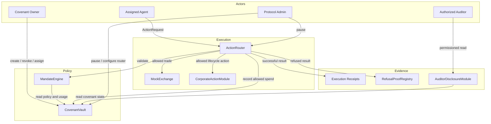
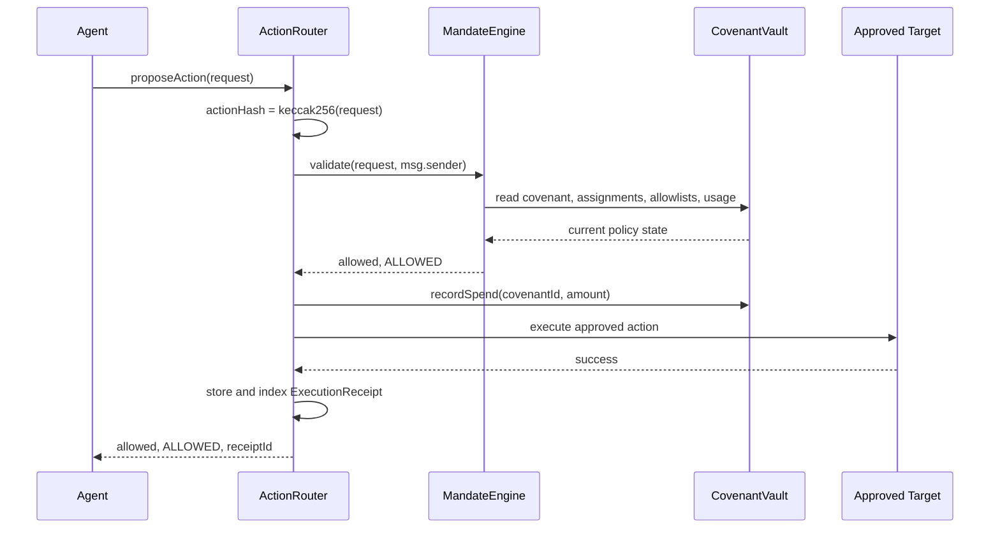
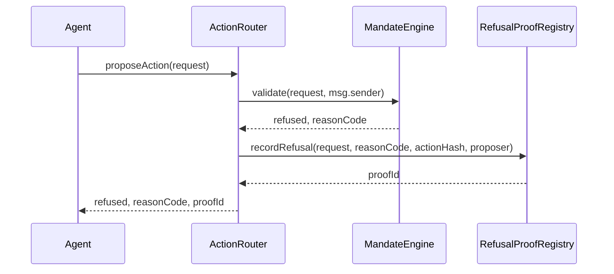
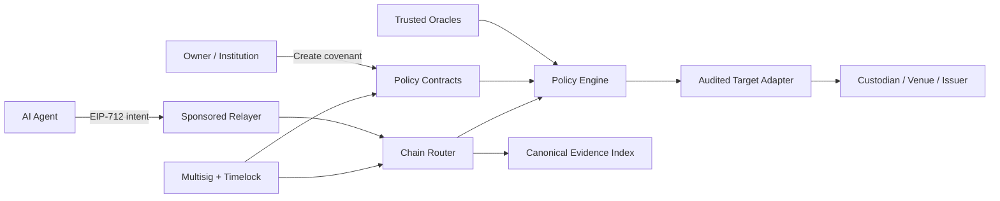

# Covenant Prime Architecture

## 1. System Objective

Covenant Prime turns broad wallet authority into bounded, inspectable, and enforceable authority.

The protocol assumes an autonomous agent may be fast, useful, compromised, mistaken, or adversarial. Safety therefore cannot depend on the agent choosing to follow an off-chain policy. Every action must pass an on-chain covenant before it can reach an execution target.

The central invariant is:

> No agent action may execute unless the current on-chain covenant explicitly permits it.

The companion audit invariant is:

> Every evaluated action produces either an indexed execution receipt or an indexed refusal proof.

## 2. Architectural Principles

### Enforcement Before Execution

Policy validation occurs before any approved target is called. Refused actions never reach the target.

### Separation Of Responsibilities

Policy storage, policy evaluation, execution routing, refusal evidence, lifecycle adapters, and disclosure controls are separate contracts with narrow responsibilities.

### Stable Machine-Readable Decisions

Refusals use a stable `ReasonCode` enum rather than free-form text. Integrators can reliably consume decisions without parsing strings.

### Recoverable On-Chain State

Covenants, successful receipts, and refusal proofs are indexed by their relevant owner, agent, or covenant. A client can reconstruct product state directly from chain without trusting local storage.

### Explicit Trust

Execution targets are not implicitly trusted. A target must be explicitly allowlisted by the covenant, and lifecycle modules expose narrow typed interfaces.

## 3. System Topology



## 4. Contract Boundaries

### CovenantTypes

Shared protocol types define the language used between contracts.

`CovenantConfig` contains:

- owner and initially assigned agent;
- lifetime, single-action, and daily spend limits;
- expiry;
- asset, target, and recipient allowlists;
- corporate-action and disclosure permissions;
- maximum slippage;
- leverage permission.

`ActionRequest` contains:

- covenant and agent identity;
- action type;
- asset, target, amount, and recipient;
- requested slippage and leverage use;
- metadata hash for action-specific data.

### CovenantVault

`CovenantVault` is the canonical policy and accounting store.

It owns:

- covenant configuration;
- covenant revocation state;
- assigned-agent state;
- asset, target, and recipient allowlists;
- lifetime and daily spend accounting;
- owner and agent covenant indexes;
- user token custody balances;
- emergency pause state.

Only the configured `ActionRouter` can call `recordSpend`. Owners can create covenants, assign or revoke agents, and revoke their covenants. Custody deposit and withdrawal paths are non-reentrant.

### MandateEngine

`MandateEngine` is a read-only policy evaluator.

It does not mutate state and does not execute targets. Given an `ActionRequest` and the actual proposer address, it returns:

```text
(allowed, reasonCode)
```

Validation order is deterministic:

1. covenant exists;
2. covenant is not revoked;
3. covenant is not expired;
4. proposer and requested agent are authorized;
5. asset is allowed;
6. target is allowed;
7. single-action limit is respected;
8. lifetime spend limit is respected;
9. daily volume limit is respected;
10. slippage is acceptable;
11. recipient is allowed;
12. leverage is permitted;
13. corporate action is permitted;
14. disclosure is permitted.

The first violated rule becomes the refusal reason.

### ActionRouter

`ActionRouter` is the sole execution gateway.

Its responsibilities are:

- hash the complete action request;
- ask `MandateEngine` for a decision;
- record an immutable refusal proof when denied;
- record spend and route the action when allowed;
- store and index an execution receipt;
- expose emergency pause and reentrancy protection.

The router never silently treats an unsupported lifecycle action as successful. Typed lifecycle targets must complete successfully or the transaction reverts.

### RefusalProofRegistry

The registry stores evidence for denied actions.

Each proof records:

- proof ID;
- covenant ID;
- actual proposer;
- action hash;
- stable reason code;
- timestamp;
- asset, amount, target, and metadata hash.

Proofs are indexed by covenant and proposer. Only the configured router can write them.

### Execution Targets

`MockExchange` demonstrates trade settlement by minting or burning mock tokenized stocks.

`CorporateActionModule` demonstrates router-only vote and dividend-claim execution. Administrative creation of votes and dividends is restricted to its admin. Unsupported action types revert.

Production deployments should replace mock targets with narrowly scoped, audited adapters for real custody, venues, issuer systems, and settlement rails.

### AuditorDisclosureModule

The disclosure module demonstrates protected audit access. An auditor may read protected trail data only when disclosure is globally permitted by the covenant or the owner grants explicit access.

## 5. Action Lifecycle

### Allowed Path



If target execution reverts, the whole transaction reverts, including spend accounting. Solidity transaction atomicity prevents a receipt or spend update from surviving a failed target call.

### Refused Path



The target is never called and spend accounting is not changed.

## 6. Policy Decision Model

The protocol supports these action types:

| Value | Action |
| --- | --- |
| `0` | BUY |
| `1` | SELL |
| `2` | TRANSFER |
| `3` | VOTE |
| `4` | DISCLOSE |
| `5` | REPAY |
| `6` | CLAIM |
| `7` | REBALANCE |

Stable refusal reasons:

| Reason | Meaning |
| --- | --- |
| `COVENANT_NOT_FOUND` | Referenced policy does not exist |
| `REVOKED_COVENANT` | Owner revoked the policy |
| `EXPIRED_COVENANT` | Policy lifetime ended |
| `UNAUTHORIZED_AGENT` | Caller or requested agent lacks assignment |
| `DISALLOWED_ASSET` | Asset is outside the policy perimeter |
| `DISALLOWED_TARGET` | Execution adapter is not approved |
| `EXCEEDS_SINGLE_ACTION_LIMIT` | Request is too large |
| `EXCEEDS_TOTAL_SPEND` | Lifetime budget would be exceeded |
| `EXCEEDS_DAILY_VOLUME` | Current UTC-day budget would be exceeded |
| `SLIPPAGE_TOO_HIGH` | Requested slippage exceeds policy |
| `UNAUTHORIZED_RECIPIENT` | Recipient is outside the policy perimeter |
| `LEVERAGE_NOT_ALLOWED` | Request uses prohibited leverage |
| `CORPORATE_ACTION_NOT_ALLOWED` | Vote or claim permission is disabled |
| `DISCLOSURE_NOT_ALLOWED` | Protected disclosure is disabled |

## 7. Core Invariants

### Authorization Invariants

- Only a covenant owner can revoke the covenant or change its agent assignments.
- Only an assigned agent calling as itself can pass agent validation.
- Only the configured router can mutate spend accounting.
- Only the configured router can create refusal proofs.
- Only the configured router can execute corporate actions.

### Policy Invariants

- A revoked or expired covenant cannot authorize execution.
- Disallowed assets, targets, and recipients cannot authorize execution.
- Successful spend cannot exceed single-action, daily, or lifetime limits.
- Prohibited leverage, corporate actions, and disclosure cannot authorize execution.

### Evidence Invariants

- A refused request creates a proof containing the actual proposer and action hash.
- A successful request creates a covenant-indexed and agent-indexed receipt.
- An unsupported lifecycle action cannot create a false receipt.

### Atomicity Invariants

- Failed target execution reverts spend accounting and receipt creation.
- Failed proof recording reverts the refusal transaction.
- Reentrancy protection prevents nested custody and router execution paths.

## 8. Frontend And Chain Synchronization

The frontend is a client of protocol state, not the source of truth.

It:

- listens for `accountsChanged` and `chainChanged`;
- switches MetaMask to Arbitrum Sepolia;
- restores the newest non-revoked, non-expired owner covenant;
- reads policy values directly from `CovenantVault`;
- reads receipt and proof indexes by covenant;
- resolves corresponding event transaction hashes;
- waits for covenant confirmation before opening execution controls;
- parses actual router and registry events rather than trusting scenario labels.

The application can be replaced or refreshed without losing protocol state.

## 9. Trust Boundaries And Threat Model

### Covenant Owner

Trusted to define the intended policy and protect the owner key. The owner can revoke the covenant and agent assignments.

### Assigned Agent

Explicitly untrusted beyond the covenant. It may submit malicious or incorrect requests, but cannot bypass router validation.

### Protocol Admin

Currently a single deployer address controls router configuration and emergency pause functions. This is acceptable for testnet but is a production centralization risk.

### Approved Targets

Targets are trusted only after being allowlisted by the owner. A malicious approved target can still behave maliciously within a transaction. Production adapters require audits, narrow interfaces, and target-specific invariants.

### RPC And Frontend

The frontend and RPC can misrepresent information, but they cannot create an authorized on-chain execution without a valid wallet transaction and successful protocol validation. Users should verify critical state through independent RPCs or explorers.

## 10. Implemented Security Controls

- caller identity and assigned-agent checks;
- covenant revocation and expiry;
- asset, target, and recipient allowlists;
- single, daily, and lifetime spend limits;
- slippage, leverage, corporate-action, and disclosure controls;
- router-only accounting and proof writing;
- typed lifecycle execution interface;
- unsupported-action rejection;
- emergency pauses;
- reentrancy guards;
- indexed receipts and refusal proofs;
- invalid configuration rejection;
- atomic target execution;
- 23 focused Foundry tests;
- CI formatting, tests, size checks, typecheck, and production build.

## 11. Known Production Gaps

The current deployment is a testnet product demonstration, not an audited mainnet protocol.

Before handling live value, the architecture requires:

1. EIP-712 signed intents with nonces, deadlines, replay protection, and scoped session keys.
2. Multisig and timelock administration with monitored emergency procedures.
3. Oracle-backed pricing, valuation, and manipulation-resistant spend accounting.
4. Position-aware accounting and conservative settlement finality.
5. Audited target adapters for real exchanges, custodians, and issuer lifecycle systems.
6. Invariant and property-based testing, formal verification, and independent audits.
7. Observability, alerting, incident response, and key-management procedures.
8. Regulatory, identity, transfer-restriction, custody, and jurisdiction review.

## 12. Deployment Model

The contracts are standard Solidity/EVM contracts and contain no Arbitrum-specific opcode dependencies.

The current canonical deployment is Arbitrum Sepolia v4.0.0. Deployment metadata, transaction hashes, and the deployment block are stored in `deployments/arbitrum-sepolia.json`.

For a new chain:

1. deploy the full contract suite;
2. configure the vault, registry, and corporate module with the new router;
3. verify all router links on-chain;
4. publish canonical deployment metadata;
5. update the frontend chain and contract configuration;
6. run the complete release gate and live smoke test.

## 13. Production Evolution

The intended production architecture separates human policy ownership from machine execution:



This preserves Covenant Prime's core property as integrations expand:

> Authority remains useful, bounded, and provable.
