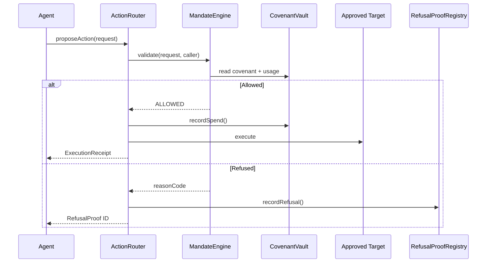

# Covenant Prime Architecture

## Design Principle

An agent never receives authority to move funds directly. It receives authority to **propose** an `ActionRequest`. The `ActionRouter` is the execution gateway, and every request is evaluated by `MandateEngine` against state held by `CovenantVault`.

## Action Flow

1. The owner creates a `CovenantConfig` and assigns an agent.
2. The agent sends an `ActionRequest` to `ActionRouter`.
3. `MandateEngine.validate` checks covenant state, caller identity, allowlists, limits, expiry, slippage, leverage, and lifecycle permissions.
4. Allowed actions update spend accounting, execute through an approved target, and create an `ExecutionReceipt`.
5. Refused actions create a permanent `RefusalProof` containing the action hash and precise reason code.

## Trust Boundaries

- **Covenant owner:** Creates, revokes, and delegates the mandate.
- **Assigned agent:** May propose actions but cannot write policy or accounting state.
- **ActionRouter:** Only contract authorized to record spend and refusal proofs.
- **MandateEngine:** Pure policy evaluator with no mutation authority.
- **Approved targets:** Explicitly allowlisted by each covenant.
- **Auditor:** Can read protected audit data only when disclosure is enabled or access is granted.

## Reason Codes

The engine returns a stable enum suitable for contracts, dashboards, and audit exports:

`COVENANT_NOT_FOUND`, `REVOKED_COVENANT`, `EXPIRED_COVENANT`, `UNAUTHORIZED_AGENT`, `DISALLOWED_ASSET`, `DISALLOWED_TARGET`, `EXCEEDS_SINGLE_ACTION_LIMIT`, `EXCEEDS_TOTAL_SPEND`, `EXCEEDS_DAILY_VOLUME`, `SLIPPAGE_TOO_HIGH`, `UNAUTHORIZED_RECIPIENT`, `LEVERAGE_NOT_ALLOWED`, `CORPORATE_ACTION_NOT_ALLOWED`, and `DISCLOSURE_NOT_ALLOWED`.

## Multi-Chain Model

Arbitrum Sepolia is the primary proof and settlement environment. The suite is standard EVM Solidity, allowing the same mock tokenized security and lifecycle modules to deploy to Robinhood Chain testnet without contract changes. A production multi-chain version would use chain-specific routers and a canonical proof index.
