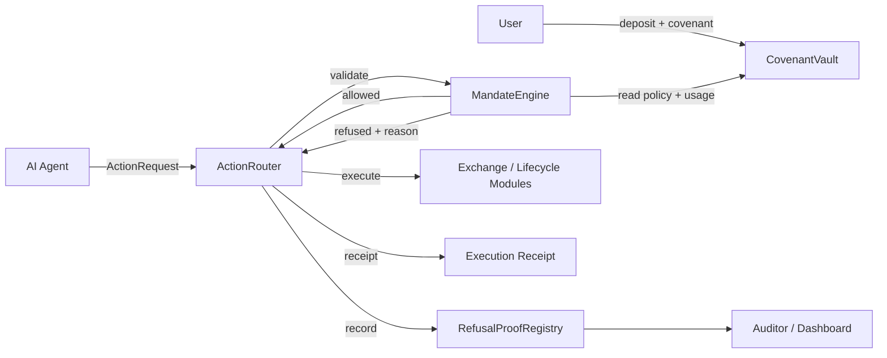

<p align="center">
  
</p>

<h1 align="center">Covenant Prime</h1>

<p align="center"><strong>AI-managed tokenized securities, enforced by on-chain covenants.</strong></p>

Covenant Prime is a proof-gated execution and lifecycle layer for AI-managed tokenized securities. A user defines an on-chain mandate, an agent proposes actions, and the protocol either executes the action or records a verifiable refusal proof explaining why it was blocked.

> AI agents can manage tokenized securities, but every action must pass the covenant.

## Why It Matters

Agent wallets are currently too binary: an agent gets broad signing authority or cannot act. Tokenized securities need a third option: bounded, transparent authority covering the full asset lifecycle. Covenant Prime enforces spend limits, asset and target allowlists, expiry, slippage, leverage, corporate action, recipient, and disclosure rules before execution.

Unsafe proposals do not disappear into an application log. `RefusalProofRegistry` preserves the action hash, covenant, agent, reason code, asset, amount, target, metadata hash, and timestamp on-chain.

## Demo

```bash
npm install
npm run dev
```

Open [http://localhost:3000](http://localhost:3000), then:

1. Create a covenant.
2. Run the valid mNVDA buy in Agent Console.
3. Run at least four attack scenarios.
4. Open Proof Dashboard and inspect a refusal proof.
5. Show Lifecycle Mode and Auditor View.

The frontend connects to MetaMask, submits live Arbitrum Sepolia transactions, waits for confirmation, parses router decisions, and restores covenant receipts and refusal proofs from chain after refresh.

## Contracts

| Contract | Purpose |
| --- | --- |
| `CovenantVault` | Custody accounting, covenant storage, agent assignment, and spend accounting |
| `MandateEngine` | Read-only validation of every proposed action |
| `ActionRouter` | Routes allowed actions and creates execution receipts |
| `RefusalProofRegistry` | Stores verifiable proofs for rejected actions |
| `MockExchange` | Simulates tokenized stock buy and sell execution |
| `MockTokenizedStock` | EVM-compatible mock mAAPL, mNVDA, and mTSLA assets |
| `CorporateActionModule` | Demonstrates voting and dividend lifecycle actions |
| `AuditorDisclosureModule` | Enforces permissioned audit-trail access |

## Architecture



See [ARCHITECTURE.md](ARCHITECTURE.md) for contract boundaries and action flow.

## Local Contract Setup

Requirements: Foundry, Node.js 20+, npm.

```bash
forge install
forge build
forge test -vv
```

Current test suite: **23 passing tests**, covering approved and refused paths, receipt/proof indexing, pause controls, invalid configs, settlement, lifecycle routing, unsupported-action rejection, vault accounting, and auditor access.

GitHub Actions runs formatting, all Foundry tests, contract-size checks, TypeScript validation, and the production frontend build on every push and pull request.

## Deploy To Arbitrum Sepolia

```bash
cp .env.example .env
source .env
forge script script/Deploy.s.sol:Deploy \
  --rpc-url "$ARBITRUM_SEPOLIA_RPC_URL" \
  --private-key "$DEPLOYER_PRIVATE_KEY" \
  --broadcast \
  --verify
```

### Deployment Addresses

Deployed to **Arbitrum Sepolia** on June 14, 2026. Full deployment metadata and transaction hashes are available in [`deployments/arbitrum-sepolia.json`](deployments/arbitrum-sepolia.json).

| Network | Contract | Address |
| --- | --- | --- |
| Arbitrum Sepolia | CovenantVault | [`0xD471...A431`](https://sepolia.arbiscan.io/address/0xD471827e261a63e9B08531C9a3bf15a61690A431) |
| Arbitrum Sepolia | MandateEngine | [`0x5E18...5FdF`](https://sepolia.arbiscan.io/address/0x5E18ec17dcE51C48291136E1d00c43DEDB1d5FdF) |
| Arbitrum Sepolia | ActionRouter | [`0x2919...1F47`](https://sepolia.arbiscan.io/address/0x29197DcF648AbC3eFfD20197A5B73D5b4c6f1F47) |
| Arbitrum Sepolia | RefusalProofRegistry | [`0xF144...032a`](https://sepolia.arbiscan.io/address/0xF1449335Cb6c1d6a841DB24B6c2959769D4B032a) |
| Arbitrum Sepolia | MockExchange | [`0x03cF...49B0`](https://sepolia.arbiscan.io/address/0x03cF8805aAA99fd3Ed0eAedc9690657eE13549B0) |
| Arbitrum Sepolia | MockUSDC | [`0x6896...f11a`](https://sepolia.arbiscan.io/address/0x68963b6D7E6F60ec10A098985942c3eD51E9f11a) |
| Arbitrum Sepolia | mAAPL | [`0xDEB5...417b`](https://sepolia.arbiscan.io/address/0xDEB5290991A9a4347E8C6bF21e5495bdDC0E417b) |
| Arbitrum Sepolia | mNVDA | [`0x794C...33b0`](https://sepolia.arbiscan.io/address/0x794C52f93d94493C636836FD246e1D0E438833b0) |
| Arbitrum Sepolia | mTSLA | [`0xF118...bBB2`](https://sepolia.arbiscan.io/address/0xF118900aaEa64Ab6e4E4976B96C25037e8D8bBB2) |
| Arbitrum Sepolia | CorporateActionModule | [`0x6384...f79f`](https://sepolia.arbiscan.io/address/0x6384Cdc7aD1154bB9B2Cbe1C0CAE4616c1A6f79f) |
| Arbitrum Sepolia | AuditorDisclosureModule | [`0x0b52...d077`](https://sepolia.arbiscan.io/address/0x0b529245b44753dC16339780FD084a40B5f5d077) |

## Robinhood Chain Compatibility

All contracts are standard Solidity/EVM contracts with no Arbitrum-specific opcodes or system contract dependencies. The deployment script can target Robinhood Chain testnet by changing the RPC URL. `MockTokenizedStock` and `CorporateActionModule` demonstrate the tokenized security and lifecycle surface until native assets and issuer modules are available.

## Repository

```text
src/                 Solidity contracts
test/                Foundry policy and refusal tests
script/              Deployment script
app/                 Next.js demo dashboard
ARCHITECTURE.md       System design and trust boundaries
DEMO_SCRIPT.md        Judge-facing demo flow
SECURITY.md           Scope, limitations, and production requirements
SUBMISSION.md         Buildathon submission copy
```

## Limitations

- Testnet hackathon proof of concept; not audited.
- Mock exchange and mock tokenized stocks do not represent real securities.
- No oracle, signature relay, upgrade process, multisig/timelock administration, or production custody controls.

## Roadmap

1. Add EIP-712 signed agent intents, nonces, session keys, and sponsored execution.
2. Integrate issuer lifecycle adapters, oracle-priced limits, and institutional custody.
3. Move administration to a multisig and timelock with monitored pause procedures.
4. Add invariant/property tests, formal verification, and independent audits.

This is not trust. This is enforceable finance.
