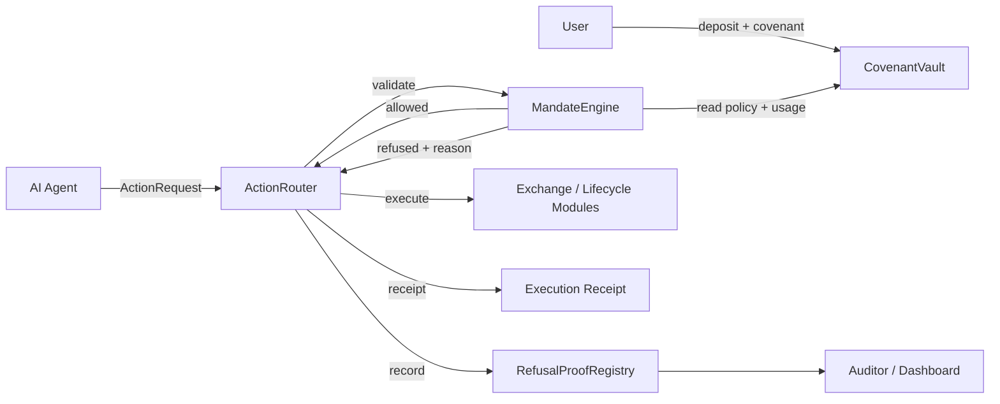

<p align="center">
  
</p>

<h1 align="center">Covenant Prime</h1>

<p align="center"><strong>AI-managed tokenized securities, enforced by on-chain covenants.</strong></p>

Covenant Prime is a proof-gated execution and lifecycle layer for AI-managed tokenized securities. A user defines an on-chain mandate, an agent proposes actions, and the protocol either executes the action or records a verifiable refusal proof explaining why it was blocked.

> AI agents can manage tokenized securities, but every action must pass the covenant.

## Why It Matters

Agent wallets are currently too binary: an agent gets broad signing authority or cannot act. Tokenized securities need a third option: bounded, transparent authority covering the full asset lifecycle. Covenant Prime enforces spend limits, asset and target allowlists, expiry, slippage, leverage, corporate action, recipient, and disclosure rules before execution.

Unsafe proposals do not disappear into an application log. `RefusalProofRegistry` preserves the action hash, covenant, agent, reason code, asset, amount, target, metadata hash, and timestamp on-chain.

## Demo

```bash
npm install
npm run dev
```

Open [http://localhost:3000](http://localhost:3000), then:

1. Create a covenant.
2. Run the valid mNVDA buy in Agent Console.
3. Run at least four attack scenarios.
4. Open Proof Dashboard and inspect a refusal proof.
5. Show Lifecycle Mode and Auditor View.

The frontend is an interactive demo surface seeded with real Arbitrum Sepolia execution and refusal transactions. New button-triggered scenarios remain deterministic simulations until wallet transaction handlers are connected.

## Contracts

| Contract | Purpose |
| --- | --- |
| `CovenantVault` | Custody accounting, covenant storage, agent assignment, and spend accounting |
| `MandateEngine` | Read-only validation of every proposed action |
| `ActionRouter` | Routes allowed actions and creates execution receipts |
| `RefusalProofRegistry` | Stores verifiable proofs for rejected actions |
| `MockExchange` | Simulates tokenized stock buy and sell execution |
| `MockTokenizedStock` | EVM-compatible mock mAAPL, mNVDA, and mTSLA assets |
| `CorporateActionModule` | Demonstrates voting and dividend lifecycle actions |
| `AuditorDisclosureModule` | Enforces permissioned audit-trail access |

## Architecture



See [ARCHITECTURE.md](ARCHITECTURE.md) for contract boundaries and action flow.

## Local Contract Setup

Requirements: Foundry, Node.js 20+, npm.

```bash
forge install
forge build
forge test -vv
```

Current test suite: **18 passing tests**, covering the required approved, refused, revoked, proof, receipt, vault, and auditor paths.

## Deploy To Arbitrum Sepolia

```bash
cp .env.example .env
source .env
forge script script/Deploy.s.sol:Deploy \
  --rpc-url "$ARBITRUM_SEPOLIA_RPC_URL" \
  --private-key "$DEPLOYER_PRIVATE_KEY" \
  --broadcast \
  --verify
```

### Deployment Addresses

Deployed to **Arbitrum Sepolia** on June 14, 2026. Full deployment metadata and transaction hashes are available in [`deployments/arbitrum-sepolia.json`](deployments/arbitrum-sepolia.json).

The deployed demo includes Covenant `#1`, one approved mNVDA execution receipt, and five refusal proofs covering cap, asset, recipient, slippage, and disclosure violations. All contracts are source-verified through Sourcify.

| Network | Contract | Address |
| --- | --- | --- |
| Arbitrum Sepolia | CovenantVault | [`0x3E17...5aa1`](https://sepolia.arbiscan.io/address/0x3E176ABabbbfeE371821662d15Bbfe1F80d75aa1) |
| Arbitrum Sepolia | MandateEngine | [`0x7DF0...1dc7`](https://sepolia.arbiscan.io/address/0x7DF0EAB671058A2Dfd1a294a6E1DA92b54191dc7) |
| Arbitrum Sepolia | ActionRouter | [`0xBd5B...c329`](https://sepolia.arbiscan.io/address/0xBd5B908a4ea337906c21608CE98B9C90E6B7c329) |
| Arbitrum Sepolia | RefusalProofRegistry | [`0xC40a...0766`](https://sepolia.arbiscan.io/address/0xC40a333420931223Ed6a3979C761E7c33Ae90766) |
| Arbitrum Sepolia | MockExchange | [`0x2bAb...3E17`](https://sepolia.arbiscan.io/address/0x2bAb2017CAC47929fdf70e9c9cA02A0A3eaf3E17) |
| Arbitrum Sepolia | MockUSDC | [`0x16AC...91F8`](https://sepolia.arbiscan.io/address/0x16AC734d33377Ad18A8E494A56E0C9Ea11cC91F8) |
| Arbitrum Sepolia | mAAPL | [`0xb0BC...eff8B`](https://sepolia.arbiscan.io/address/0xb0BCB050B5557F8Db56B9C063dAC6b4DBB4eff8B) |
| Arbitrum Sepolia | mNVDA | [`0x0885...c110`](https://sepolia.arbiscan.io/address/0x0885e072A83f3b5950E0430C25b3F395962Ac110) |
| Arbitrum Sepolia | mTSLA | [`0xe6E6...8072`](https://sepolia.arbiscan.io/address/0xe6E61B5f19938e103269611313C64C58FFB68072) |
| Arbitrum Sepolia | CorporateActionModule | [`0x2e9a...C0C9`](https://sepolia.arbiscan.io/address/0x2e9a0D452842Be3300a14c5439c2A86a651dC0C9) |
| Arbitrum Sepolia | AuditorDisclosureModule | [`0x2A2b...C928`](https://sepolia.arbiscan.io/address/0x2A2b4aB18A6C475CfcBd8f103106F52256f1C928) |

## Robinhood Chain Compatibility

All contracts are standard Solidity/EVM contracts with no Arbitrum-specific opcodes or system contract dependencies. The deployment script can target Robinhood Chain testnet by changing the RPC URL. `MockTokenizedStock` and `CorporateActionModule` demonstrate the tokenized security and lifecycle surface until native assets and issuer modules are available.

## Repository

```text
src/                 Solidity contracts
test/                Foundry policy and refusal tests
script/              Deployment script
app/                 Next.js demo dashboard
ARCHITECTURE.md       System design and trust boundaries
DEMO_SCRIPT.md        Judge-facing demo flow
SECURITY.md           Scope, limitations, and production requirements
SUBMISSION.md         Buildathon submission copy
```

## Limitations

- Testnet hackathon proof of concept; not audited.
- Mock exchange and mock tokenized stocks do not represent real securities.
- New frontend demo actions are deterministic simulations; seeded receipt and refusal records link to real Arbitrum Sepolia transactions.
- No oracle, signature relay, upgrade process, or production custody controls.

## Roadmap

1. Deploy and verify the core suite on Arbitrum Sepolia and Robinhood Chain testnet.
2. Connect the dashboard to deployed contracts using viem.
3. Add EIP-712 signed agent intents and sponsored execution.
4. Integrate issuer lifecycle modules, oracle-priced limits, and institutional custody.
5. Add formal verification, independent audits, and production governance.

This is not trust. This is enforceable finance.
