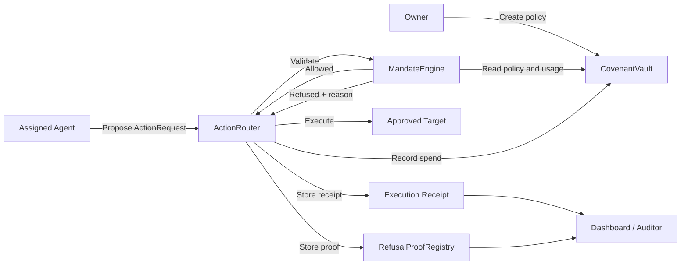

<p align="center">
  
</p>

<h1 align="center">Covenant Prime</h1>

<p align="center">
  <strong>Enforceable on-chain authority for autonomous financial agents.</strong>
</p>

<p align="center">
  <a href="#live-deployment">Live Deployment</a> ·
  <a href="#run-locally">Run Locally</a> ·
  <a href="ARCHITECTURE.md">Architecture</a> ·
  <a href="#security-status">Security</a>
</p>

---

## The Problem

Autonomous agents need permission to act, but a normal wallet gives them a dangerous binary choice: full signing authority or no authority at all.

Financial delegation requires a stronger primitive. An agent should be able to act quickly inside explicit limits while being physically unable to cross them.

## The Solution

Covenant Prime is a proof-gated execution layer for AI-managed tokenized securities and on-chain financial actions.

A user creates an on-chain covenant defining:

- the assigned agent;
- allowed assets, execution targets, and recipients;
- maximum single-action, daily, and lifetime spend;
- expiry and maximum slippage;
- leverage, corporate-action, and disclosure permissions.

Every agent request passes through `ActionRouter` and is evaluated by `MandateEngine` before execution.

- **Allowed actions** execute through an approved target and produce an indexed execution receipt.
- **Refused actions** never reach the target and produce an immutable refusal proof containing the violated rule and attempted action details.

> Agents can act. They cannot betray the mandate.

## Why Covenant Prime

Most safety systems only document successful transactions. Covenant Prime also creates verifiable evidence for unsafe actions that never happened.

This gives users, auditors, institutions, and agent operators:

- enforceable delegated authority instead of policy promises;
- precise on-chain reason codes for every refusal;
- covenant-scoped execution receipts and refusal proofs;
- deterministic state recovery after refresh or client replacement;
- explicit lifecycle controls for trades, votes, claims, and disclosure;
- an EVM-native foundation for tokenized securities and RWAs.

## Live Product Behavior

The Next.js application is connected directly to Arbitrum Sepolia through MetaMask and viem.

It:

1. connects or switches the wallet to Arbitrum Sepolia;
2. creates a user-signed covenant;
3. waits for on-chain confirmation before opening the Agent Console;
4. submits live agent actions to `ActionRouter`;
5. parses the actual execution or refusal event from the receipt;
6. restores active covenants, execution receipts, and refusal proofs from chain;
7. links every on-chain result to Arbiscan.

The application does not require private keys or server-side environment variables in Vercel.

## Protocol At A Glance



For contract boundaries, invariants, execution sequencing, threat model, and production architecture, read **[ARCHITECTURE.md](ARCHITECTURE.md)**.

## Core Contracts

| Contract | Responsibility |
| --- | --- |
| `CovenantVault` | Stores covenant policy, assignments, allowlists, custody balances, spend accounting, revocation, and pause state |
| `MandateEngine` | Read-only policy evaluator returning stable allow/refuse reason codes |
| `ActionRouter` | Sole execution gateway; validates, routes, records spend, and indexes receipts |
| `RefusalProofRegistry` | Stores immutable, covenant-indexed and agent-indexed refusal proofs |
| `CorporateActionModule` | Router-only adapter for governed vote and dividend-claim actions |
| `AuditorDisclosureModule` | Owner-controlled protected audit access |
| `MockExchange` | Testnet execution adapter that settles mock tokenized stock buys and sells |
| `MockTokenizedStock` / `MockUSDC` | Testnet-only assets used to demonstrate settlement and lifecycle behavior |

## Enforced Policy Surface

`MandateEngine` rejects requests for:

- unknown, revoked, or expired covenants;
- unauthorized agents;
- disallowed assets, targets, or recipients;
- actions above the single-action limit;
- actions exceeding lifetime or daily volume;
- slippage above the covenant maximum;
- prohibited leverage;
- prohibited corporate actions;
- prohibited disclosure.

Reason codes are stable Solidity enums suitable for dashboards, integrations, and audit exports.

## Live Deployment

Final protocol version: **v4.0.0**

Network: **Arbitrum Sepolia**

Chain ID: **421614**

Deployment block: **277147634**

| Contract | Address |
| --- | --- |
| CovenantVault | [`0xD471827e261a63e9B08531C9a3bf15a61690A431`](https://sepolia.arbiscan.io/address/0xD471827e261a63e9B08531C9a3bf15a61690A431) |
| MandateEngine | [`0x5E18ec17dcE51C48291136E1d00c43DEDB1d5FdF`](https://sepolia.arbiscan.io/address/0x5E18ec17dcE51C48291136E1d00c43DEDB1d5FdF) |
| ActionRouter | [`0x29197DcF648AbC3eFfD20197A5B73D5b4c6f1F47`](https://sepolia.arbiscan.io/address/0x29197DcF648AbC3eFfD20197A5B73D5b4c6f1F47) |
| RefusalProofRegistry | [`0xF1449335Cb6c1d6a841DB24B6c2959769D4B032a`](https://sepolia.arbiscan.io/address/0xF1449335Cb6c1d6a841DB24B6c2959769D4B032a) |
| MockExchange | [`0x03cF8805aAA99fd3Ed0eAedc9690657eE13549B0`](https://sepolia.arbiscan.io/address/0x03cF8805aAA99fd3Ed0eAedc9690657eE13549B0) |
| MockUSDC | [`0x68963b6D7E6F60ec10A098985942c3eD51E9f11a`](https://sepolia.arbiscan.io/address/0x68963b6D7E6F60ec10A098985942c3eD51E9f11a) |
| mAAPL | [`0xDEB5290991A9a4347E8C6bF21e5495bdDC0E417b`](https://sepolia.arbiscan.io/address/0xDEB5290991A9a4347E8C6bF21e5495bdDC0E417b) |
| mNVDA | [`0x794C52f93d94493C636836FD246e1D0E438833b0`](https://sepolia.arbiscan.io/address/0x794C52f93d94493C636836FD246e1D0E438833b0) |
| mTSLA | [`0xF118900aaEa64Ab6e4E4976B96C25037e8D8bBB2`](https://sepolia.arbiscan.io/address/0xF118900aaEa64Ab6e4E4976B96C25037e8D8bBB2) |
| CorporateActionModule | [`0x6384Cdc7aD1154bB9B2Cbe1C0CAE4616c1A6f79f`](https://sepolia.arbiscan.io/address/0x6384Cdc7aD1154bB9B2Cbe1C0CAE4616c1A6f79f) |
| AuditorDisclosureModule | [`0x0b529245b44753dC16339780FD084a40B5f5d077`](https://sepolia.arbiscan.io/address/0x0b529245b44753dC16339780FD084a40B5f5d077) |

Complete deployment addresses and transaction hashes are stored in [`deployments/arbitrum-sepolia.json`](deployments/arbitrum-sepolia.json).

## Run Locally

### Requirements

- Node.js 20+
- npm
- Foundry
- MetaMask with Arbitrum Sepolia ETH

### Frontend

```bash
npm ci
npm run dev
```

Open [http://https://covenant-prime.vercel.app](http://https://covenant-prime.vercel.app).

### Contracts

```bash
forge build
forge test -vv
forge build --sizes
```

The current suite contains **23 passing Foundry tests** covering:

- allowed execution and mock settlement;
- every policy refusal class;
- refusal proof and receipt indexing;
- revoked and expired covenants;
- pause and reentrancy protections;
- invalid policy configuration;
- lifecycle routing and unsupported-action rejection;
- vault custody and auditor access.

### Deploy

Create `.env.local`:

```dotenv
ARBITRUM_SEPOLIA_RPC_URL=https://sepolia-rollup.arbitrum.io/rpc
DEPLOYER_PRIVATE_KEY=
```

Never expose `DEPLOYER_PRIVATE_KEY` in Vercel or any client environment.

```bash
set -a
source .env.local
set +a

forge script script/Deploy.s.sol:Deploy \
  --rpc-url "$ARBITRUM_SEPOLIA_RPC_URL" \
  --private-key "$DEPLOYER_PRIVATE_KEY" \
  --broadcast
```

## Continuous Integration

Every push and pull request runs:

- pinned Foundry formatting;
- all Foundry tests;
- contract-size checks;
- TypeScript validation;
- the production Next.js build.

The GitHub Actions workflow uses pinned Foundry `v1.2.3` and Node 24-compatible action runtimes.

## Security Status

Implemented controls include:

- strict caller and assigned-agent validation;
- immutable policy evaluation through `MandateEngine`;
- target, asset, and recipient allowlists;
- spend, volume, expiry, slippage, leverage, and lifecycle controls;
- router-only spend accounting and proof creation;
- emergency pause controls;
- reentrancy guards on custody and execution paths;
- narrow typed lifecycle calls;
- rejection of unsupported lifecycle actions;
- deterministic receipt and proof indexes.

This deployment is testnet-only and has not received an external audit. Mock assets and `MockExchange` do not represent real securities or production settlement.

Before mainnet or live-value use, the protocol requires independent audits, invariant/property testing, formal verification, multisig and timelock administration, EIP-712 intents with replay protection, oracle-backed valuation, production custody, operational monitoring, and regulatory review.

## Repository Layout

```text
app/                          Next.js product interface
src/                          Solidity protocol contracts
test/                         Foundry test suite
script/                       Deployment scripts
deployments/                  Canonical deployment metadata
.github/workflows/ci.yml      Release gates
README.md                     Product and operator guide
ARCHITECTURE.md               Protocol architecture and threat model
```

## Product Direction

The next production milestones are:

1. EIP-712 agent intents with nonces, deadlines, replay protection, and session keys.
2. Oracle-priced policy limits and position-aware accounting.
3. Production target adapters for custody, exchanges, and issuer lifecycle systems.
4. Multisig and timelock governance with monitored emergency procedures.
5. Independent audits, formal verification, and institutional integration.

---

<p align="center"><strong>This is not trust. This is enforceable finance.</strong></p>
